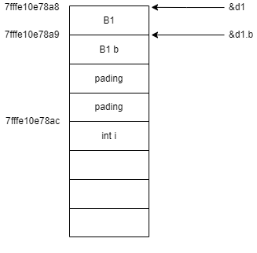
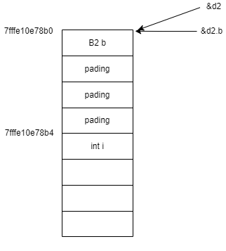

# POD 类型

POD 类型，既 Plain Old Data 的缩写。通常用于表示一个类型的属性，尤其是自定义用户类型的属性。

POD 类型指的是普通的旧数据类型，所谓的平凡指的是不存在虚函数虚继承那样的特别性质，所谓的旧指的是与 C 的兼容性，比如能够使用 memcpy() 函数进行复制，memset() 函数进行初始化。
综上，POD 指的是平凡的（trivial）和标准布局的（standard layout）

## POD Trivial

### Trivial 的定义

通常情况下，一个平凡的类或者结构体应该符合以下定义：
1. 拥有平凡的构造函数和析构函数
2. 拥有平凡的拷贝构造函数和移动构造函数
3. 拥有平凡的拷贝赋值运算符和移动赋值运算符
4. 不能包含虚函数以及虚基类。

以上六种函数的平凡的意思就是指编译器默认生成的，不做任何事情的函数。
如果代码中显示声明了一个不做任何事情的函数，比如构造函数，那么该类就不算是 POD 类型了。
但是 default 关键字修饰的自定义的构造函数等等，能够符合平凡的定义。

### Trivial 的判断

可以通过辅助的模板类来帮助我们进行属性的判断。

```
#include <iostream>
#include <type_traits>

using namespace std;

struct Trivial1{
    /* data */
};

struct Trivial2{
public:
    int a;
private:
    int b;
};

struct Trivial3{
    Trivial1 a;
    Trivial2 b;
};

struct Trivial4 {
    Trivial2 a[23];
};


struct Trivial5 {
    int x;
    static int y;
};

struct NonTrivial1 {
    NonTrivial1() : z(42){}
    int z;
};

struct NonTrivial2 {
    NonTrivial2();
    int ws;
};

NonTrivial2::NonTrivial2() = default;

struct NonTrivial3 {
    Trivial5 c;
    virtual void f();
};

int main()
{
    cout << is_trivial<Trivial1>::value << endl;
    cout << is_trivial<Trivial2>::value << endl;
    cout << is_trivial<Trivial3>::value << endl;
    cout << is_trivial<Trivial4>::value << endl;
    cout << is_trivial<Trivial5>::value << endl;
    cout << is_trivial<NonTrivial1>::value << endl;
    cout << is_trivial<NonTrivial2>::value << endl;
    cout << is_trivial<NonTrivial3>::value << endl;

    return 0;
}
```

### Standard Layout 定义

POD 还有另外一种概念，就是标准布局。标准布局的类或者结构体应该符合以下定义：

1. 所有非静态成员有相同的访问权限。
2. 在类和结构体继承时，应该满足以下两种权限的其中一种
    1. 派生类中有非静态成员，且只有一个仅包含静态成员的基类
    2. 基类有静态成员，而派生类没有非静态成员
3. 类中第一个非静态成员的类型与其基类不同
4. 没有虚基类和虚函数
5. 所有非静态成员均符合标准布局类型，其基类也符合标准布局。

#### 定义1

所有非静态成员有相同的访问权限，这个很好解释

```
struct 
{
public:
    int a;
private:
    int b;
};
```

该类中 a，b 拥有不同权限，所以该匿名结构体就不是标准布局。

#### 定义2

```
struct B1 {static int a;};  //  只有静态成员的基类
struct D1 : B1 {int d;};    //  只有一个有静态成员的父类，符合标准布局

struct B2 {int a;};         //  有非静态成员的父类
struct D2 : B2 {static int d;};  // 继承有非静态成员的父类，但是自身没有非静态成员，所以也是标准布局

struct D3 : B2, B1 {static int d;};     // 继承两个父类，但是自身没有非静态成员，所以也是标准布局
struct D4 : B2 {int d;};                // 继承的父类有非静态成员，自己也有非静态成员，所以不是标准布局
struct D5 : B2, D1 {};                  // 继承两个父类，有一个父类有非静态成员，所以不是标准布局
```

### 定义3

```
struct A : B {B b;}; // 不是标准布局，因为第一个成员变量和继承的父类的类型相同
struct C : B {int a; B b;}; // 是标准布局，因为第一个成员变量和继承的父类的类型不同
```

该规则主要是基于 C++ 中允许优化不包含成员基类而产生。
如以下示例：
```
#include <iostream>
using namespace std;

struct B1 {};
struct B2 {};

struct D1 : B1 {
    B1 b;
    int i;
};

struct D2 : B1 {
    B2 b;
    int i;
};

int main()
{
    D1 d1;
    D2 d2;
    cout << hex;
    cout << reinterpret_cast<long long>(&d1) << endl;
    cout << reinterpret_cast<long long>(&d1.b) << endl;
    cout << reinterpret_cast<long long>(&d1.i) << endl;

    cout << reinterpret_cast<long long>(&d2) << endl;
    cout << reinterpret_cast<long long>(&d2.b) << endl;
    cout << reinterpret_cast<long long>(&d2.i) << endl;

    return 0;  
}

// 运行结果
7fffe10e78a8
7fffe10e78a9
7fffe10e78ac
7fffe10e78b0
7fffe10e78b0
7fffe10e78b4
```

D1 和 D2 都继承了 B1，且都包含了一个空类的成员变量，区别是 D1 包含了的父类的成员变量，而 D2 包含的是无关联的一个类。按照猜想， D1 和 D2 应该是相同的内存布局，但是打印出类地址以及类中成员变量的地址后，发现他们的内存布局并不相同。

d2 和它的第一个成员变量共享了一个地址，但是 d1 确实分开的。

事实上，在 C++11 标准中，如果没有基类成员，标准允许派生类的第一个成员与基类共享地址。
因为派生类的地址总是“堆叠”在基类上，所以这样的地址共享，表明基类并没有占据任何空间。
但是如果基类的第一个成员仍然是基类，编译器仍然为基类分配一个 1 字节的空间，这是因为 C++ 标准要求类型相同的对象地址必须不同（基类地址以及派生类成员 d 地址必须不同），这个就是 D1 和 D2 两个类型布局不同的原因。

两者的内存布局如下所示



### 标准布局的判断

可以使用辅助模板 `template <typename T> struct std::is_standard_layout` 来判断是否是一个标准布局

```
#include <iostream>
using namespace std;

struct SLayout1 {};
struct SLayout2 {
private:
    int x;
    int y;
};

struct SLayout3 : SLayout1 {
    int x;
    int y;
    void f();
};

struct SLayout4 : SLayout1 {
    int x;
    SLayout1 y;
};

struct SLayout5 : SLayout1, SLayout3 {};

struct SLayout6 {
    static int y;
};

struct SLayout7 : SLayout6 {
    int x;
};

struct NonSLayout1 : SLayout1 {
    SLayout1 x;
    int i;
};

struct NonSLayout2 : SLayout2 { int z; };

struct NonSLayout3 : NonSLayout2 {};

struct NonSLayout4 {
public:
    int x;
private:
    int y;
};

int main() {
    cout << is_standard_layout<SLayout1>::value << endl;    // 1
    cout << is_standard_layout<SLayout2>::value << endl;    // 1
    cout << is_standard_layout<SLayout3>::value << endl;    // 1
    cout << is_standard_layout<SLayout4>::value << endl;    // 1
    cout << is_standard_layout<SLayout5>::value << endl;    // 1
    cout << is_standard_layout<SLayout6>::value << endl;    // 1
    cout << is_standard_layout<SLayout7>::value << endl;    // 1

    cout << is_standard_layout<NonSLayout1>::value << endl;    // 0
    cout << is_standard_layout<NonSLayout2>::value << endl;    // 0
    cout << is_standard_layout<NonSLayout3>::value << endl;    // 0
    cout << is_standard_layout<NonSLayout4>::value << endl;    // 0

    return 0;
}
```

## POD 的判断

POD 在 C++11 的标准中，定义就是平凡的，和标准布局两个方面。
如果想要判断某一类型是否是 POD，标准库中的 <type_traits> 头文件提供了一个 `template <typename_T> struct std::os_pod` 辅助模板类。

```
#include <iostream>
#include <type_traits>

using namespace std;

union U {};
union U1 {
    U1(){};
};

enum E{};

typedef double* DA;
typedef void (*PF)(int, double);

int main()
{
    cout << is_pod<U>::value << endl;   // 1
    cout << is_pod<U1>::value << endl;  // 0
    cout << is_pod<E>::value << endl;   // 1
    cout << is_pod<int>::value << endl;   // 1
    cout << is_pod<DA>::value << endl;   // 1
    cout << is_pod<PF>::value << endl;   // 1

    return 0;
}
```

内置类型基本都是 POD，但是类和结构体上的判断是比较复杂的。

## 好处

POD 的好处如下：
1. 字节赋值，代码中可以安全的使用 memset 和 memcpy 对 POD 类型进行初始化和拷贝；
2. 提供对 C 内存布局兼容，C++ 程序可以和 C 进行相互操作，POD 类型的数据在 C 和 C++ 之间的操作是安全的；
3. 保证了静态初始化的安全有效。静态初始化在很多时候能够提高程序性能，而 POD 类型的对象初始化往往会更简单，比如放入目标文件的 .bss 段，在初始化中直接被赋值为 0
